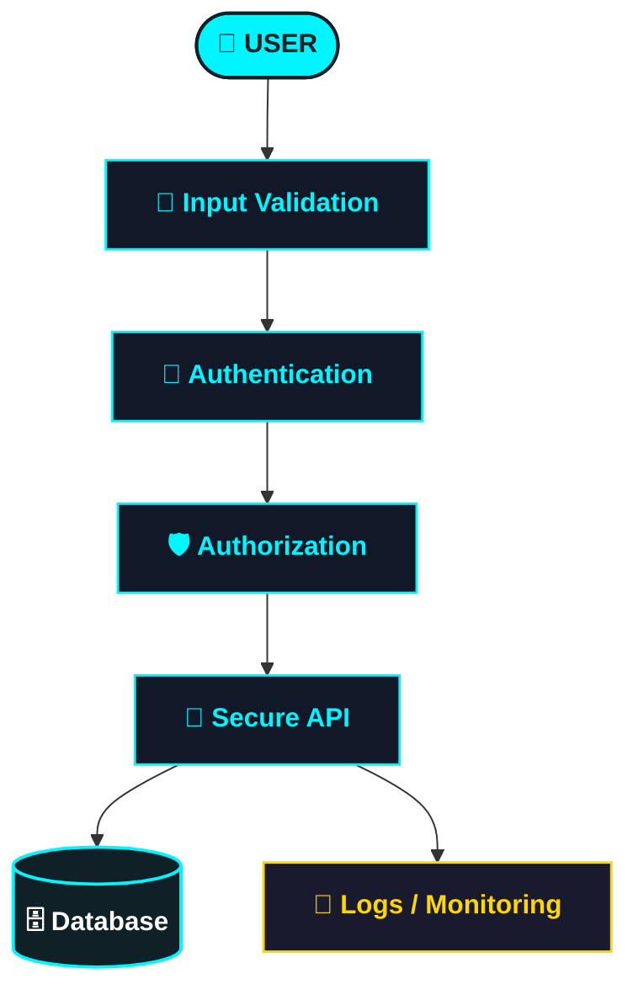

<div align="center">


<br>

<p>
<a href="https://github.com/ahmedaborashed">

</a>
<a href="https://wa.me/201020084862">

</a>
<a href="https://github.com/ahmedaborashed?tab=repositories">

</a>
</p>


</div>

<br>

## 🧠 About Me

I don't just write code — I build systems.

```
Frontend  →  Backend  →  Database  →  Security  →  Deployment
```

I enjoy taking an idea from **zero → a working product** with clean architecture, useful UX, and a security-first mindset.

<br>

## 🚀 Featured Projects

<!--
  ✏️ HOW TO ADD YOUR OWN SCREENSHOT FOR EACH PROJECT:
  Replace the line: 
  with a direct link to YOUR image (e.g. an image you upload to the repo
  under a folder like /assets/ and link as:
  https://raw.githubusercontent.com/ahmedaborashed/REPO_NAME/main/assets/preview.png
-->

<table width="100%">
<tr>
<td width="50%" valign="top">

### 🛡️ IPS-by-ML
**Machine Learning + Security**

<a href="https://github.com/ahmedaborashed/IPS-by-ML">

</a>

<a href="https://github.com/ahmedaborashed/IPS-by-ML">

</a>

</td>
<td width="50%" valign="top">

### 🏥 Nursing Room Project
**Healthcare Management System**

<a href="https://github.com/ahmedaborashed/Nursing-Room-Project">

</a>

<a href="https://github.com/ahmedaborashed/Nursing-Room-Project">

</a>

</td>
</tr>
<tr>
<td width="50%" valign="top">

### 🥋 Taekwondo Academy System
**Academy & Athlete Management**

<a href="https://github.com/ahmedaborashed/Taekwondo-Academy-System">

</a>

<a href="https://github.com/ahmedaborashed/Taekwondo-Academy-System">

</a>

</td>
<td width="50%" valign="top">

### 💍 Invitation Wedding
**Modern Wedding Invitation**

<a href="https://github.com/ahmedaborashed/invitation-wedding">

</a>

<a href="https://github.com/ahmedaborashed/invitation-wedding">

</a>

</td>
</tr>
<tr>
<td width="50%" valign="top">

### 🤖 Chatbot
**Conversational AI Project**

<a href="https://github.com/ahmedaborashed/chatbot">

</a>

<a href="https://github.com/ahmedaborashed/chatbot">

</a>

</td>
<td width="50%" valign="top">

</td>
</tr>
</table>

<br>

## ⚙️ Tech Stack

<div align="center">


<br><br>

**Languages & Frameworks**
`HTML` `CSS` `JavaScript` `TypeScript` `React` `Next.js` `Node.js` `Express` `Python` `Java` `PHP`

**Databases**
`MySQL` `PostgreSQL` `MongoDB` `Redis`

**Tools & DevOps**
`Git` `GitHub` `Docker` `Linux` `REST APIs`

</div>

<br>

## 🔐 Security Mindset



<div align="center">

**Focus:** `Web Security` · `OWASP` · `API Security` · `Authentication` · `Authorization` · `Linux` · `Networking`

</div>

<br>

## 📊 GitHub Analytics

<div align="center">


<br><br>


<br><br>


</div>

<br>

## 🧩 Explore More

<div align="center">

| Project | Type | Link |
|---|---|---|
| 🛡️ IPS-by-ML | Security / ML | [Open](https://github.com/ahmedaborashed/IPS-by-ML) |
| 🏥 Nursing-Room-Project | Management | [Open](https://github.com/ahmedaborashed/Nursing-Room-Project) |
| 🥋 Taekwondo-Academy-System | Management | [Open](https://github.com/ahmedaborashed/Taekwondo-Academy-System) |
| 💍 invitation-wedding | Web | [Open](https://github.com/ahmedaborashed/invitation-wedding) |
| 🤖 chatbot | AI | [Open](https://github.com/ahmedaborashed/chatbot) |

<a href="https://github.com/ahmedaborashed?tab=repositories">

</a>

</div>

<br>

## 🤝 Let's Connect

<div align="center">

<a href="https://wa.me/201020084862">

</a>
<a href="https://github.com/ahmedaborashed">

</a>

<br><br>

**BUILD ⚡ SECURE 🔐 ANALYZE 📊 SHIP 🚀**


</div>
